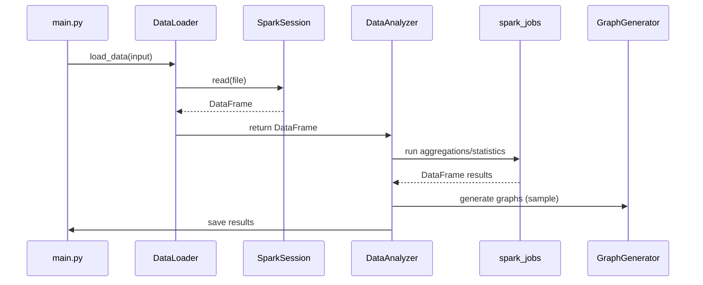

**Project Architecture Overview**

This document describes how the Parallel Data Analysis project is organized, how components interact, and important operational details. It includes simple diagrams (Mermaid and ASCII) to help visualize data flow and deployment.

**Scope**: files under `Script/` (entrypoint: `Script/src/main.py`) and job helpers under `Script/spark_jobs/`.

**Contents**
- **Overview** — high-level description and purpose
- **Components** — responsibilities and key functions
- **Data Flow** — diagrams and sequence of operations
- **Deployment** — Docker Compose structure and run modes
- **I/O and conventions** — outputs, timestamping, and file naming
- **Operational notes** — scaling, common issues, troubleshooting

**Overview**

The project is a small framework for running parallel data analyses using Apache Spark (PySpark). It supports ingesting CSV/JSON/Parquet/Avro, running aggregations/statistics/MapReduce-style jobs, and generating visualizations and reports. The system runs either locally (Spark local[*]) or inside a Docker-based Spark cluster using `docker-compose` defined in `Script/docker_compose.yml`.

**Components**

- **Entry / Orchestration**: `Script/src/main.py` (class `ParallelDataAnalysis`) — CLI entrypoint. Parses args, initializes SparkSession, coordinates data load, analysis steps, graph generation, and result persistence.

- **Data Loader**: `Script/src/data_loader.py` — reads input files (CSV/JSON/Parquet/Avro), returns cached Spark DataFrames. Exposes `load_data(file_path)` which returns a Spark DataFrame ready for analysis.

- **Data Analyzer**: `Script/src/data_analyzer.py` — high-level analysis orchestration (statistical analysis, aggregation, correlation, windowed analyses). Uses `spark_jobs` helpers for heavy operations. It prefers Spark-native operations and only produces small previews for driver-side tasks.

- **Spark Job Modules**: `Script/spark_jobs/`
  - `mapreduce_job.py` — MapReduce-style helpers (word count, group_sum, moving_average, top_n_by_group).
  - `aggregation_job.py` — multi-level, cube, rollup, pivot, time-series aggregations.
  - `statistical_analysis.py` — descriptive stats, correlation, covariance, hypothesis testing, anomaly detection, time-series decomposition.

- **Graph Generator**: `Script/src/graph_generator.py` — builds visualizations (matplotlib/seaborn/plotly). It samples results before converting to pandas to avoid OOM on large datasets.

- **Performance Monitor**: `Script/performance_monitor.py` — wraps timing instrumentation. Call `start_stage`/`end_stage` around major work.

- **Error Handler**: `Script/error_handler.py` — centralized error logging and report generation (writes to `output/failures`). Use `ErrorHandler` to log and persist exceptions.

- **Support & Examples**: `Script/src/advanced_example.py`, `Script/src/example_test.py` provide runnable examples showing how to use the framework.

**How components interact (short)**

1. `main.py` parses CLI args and creates SparkSession.
2. `DataLoader.load_data()` reads the input into a Spark DataFrame and caches it (if appropriate).
3. `DataAnalyzer` calls job helpers in `spark_jobs` to run aggregations, statistical analyses, and MapReduce tasks.
4. `GraphGenerator` is called with a (small) sampled DataFrame to create PNG/HTML visualizations.
5. `ParallelDataAnalysis.save_results()` writes Spark results to disk using Spark writers, and also writes a safe preview CSV (limited rows converted to pandas).
6. `ErrorHandler` and `PerformanceMonitor` provide consistent logging and metrics.

**Data Flow Diagram (Mermaid)**

```mermaid
flowchart TD
  A[CLI: main.py] --> B[DataLoader]
  B --> C[Cached Spark DataFrame]
  C --> D[DataAnalyzer]
  D -->|calls| E[spark_jobs (aggregation/mapreduce/statistics)]
  E --> F[Result Spark DataFrame]
  F --> G[Save via Spark writer]
  F --> H[GraphGenerator (sample->toPandas)]
  H --> I[PNG/HTML graphs in output/general/graphs]
  G --> J[output/general/results_<timestamp>_spark/]
  G --> K[output/general/results_<timestamp>.csv (preview)]
  D --- L[PerformanceMonitor]
  D --- M[ErrorHandler]
```

If Mermaid is not rendered in your viewer, here's a simple ASCII flow:

CLI(main.py) -> DataLoader -> Spark DataFrame (cached)
    -> DataAnalyzer -> spark_jobs.* -> Spark DataFrame results
    -> Save results (Spark write + small preview CSV)
    -> GraphGenerator (sample -> toPandas -> plot) -> output/graphs

**Sequence (example: run 'full' analysis)**



**Deployment / Run modes**

- Local (developer):
  - Requires PySpark + numeric libs installed in the environment. Run:
    ```powershell
    python Script/src/main.py --input Script/data/input/sample_sales.csv --master local[*] --analysis full
    ```

- Docker (recommended for reproducibility):
  - `Script/docker_compose.yml` defines a `spark-master` and `spark-worker-*` services.
  - Build/start cluster: `cd Script; docker-compose up -d` (or use the repository's `makefile` targets).
  - Run inside master (example):
    ```powershell
    docker exec -it spark-master bash
    # inside container
    python /app/main_py.py --input /app/data/input/sample_sales.csv --master spark://spark-master:7077 --analysis full
    ```

**Docker/Deployment ASCII diagram**

```
+-------------------------+        +-----------------------+
|  spark-master (App)    | <----> |  spark-worker-1       |
|  (REST UI: 8080)      | <----> |  spark-worker-2       |
|  Driver, Controller   |        |  (executors)         |
+------------------------+        +-----------------------+
```

**I/O and conventions**

- Input: `--input <path>` accepts CSV/JSON/Parquet/Avro. Use `DataLoader` to infer schema.
- Output: `Script/output/general/` with:
  - `results_<timestamp>.csv` — driver-side preview (limited rows).
  - `results_<timestamp>_spark/` — Spark-writer output (partitioned CSVs or parquet depending on implementation).
  - `analysis_<timestamp>.json` — analysis metadata and summary.
  - `graphs/` — PNG files named with analysis type + timestamp.
- Timestamp format: `YYYYmmdd_HHMMSS` — used to namespace outputs.

**Important implementation details & gotchas**

- Avoid full `DataFrame.toPandas()` on large datasets — the code now samples before converting for plotting and preview.
- `DataAnalyzer` uses Spark native functions (e.g., `df.stat.corr`) for large-scale correlation; only small datasets are converted to pandas.
- If you run into dependency/build issues on Windows (numpy/pandas wheels), prefer Conda or run inside the Docker images where prebuilt binaries are available.

**Performance & scaling notes**

- Use `df.cache()` on DataFrames that are reused across multiple stages.
- Partitioning: for large datasets, tune `repartition()` based on data size and cluster executors.
- When adding long-running stages, wrap them with `PerformanceMonitor.start_stage(...)` and `end_stage(...)` for consistent reporting.

**Troubleshooting**

- Pip install fails on Windows when building `numpy`/`pandas`: use Conda or run inside Docker. See `Script/requirements.txt` for required versions.
- If graphs fail due to memory, check that GraphGenerator samples fewer rows (the default safe sample size is implemented) or reduce sample size manually.
- If Spark tasks hang, check the `spark-master` UI (port 8080 by default in Docker compose) and container logs.

**Run checklist (quick)**

1. Ensure Spark is available (`local[*]` or Docker cluster running).
2. Provide input: `Script/data/input/sample_sales.csv` (example included).
3. Run orchestration: `python Script/src/main.py --input <path> --master <master-url> --analysis full`.
4. Inspect `Script/output/general` for results and `graphs/` for plots.

**Next steps & suggestions**

- Consider creating a lightweight `Script/run_smoke.ps1` that sets up a venv, installs minimal deps, and runs a smoke test.
- Add a `Script/CONTRIBUTING.md` with conventions (naming, timestamping, how-to-run locally vs docker).
- Add CI workflow to run unit/smoke tests in a Linux runner (avoids Windows wheel issues).

---

This file was generated to help you re-orient with the repo layout and to make it easier to continue refactoring or running tests. If you'd like I can also:
- create a `Script/environment.yml` for conda-based installs;
- add a `run_smoke.ps1` or `run_smoke.sh` that performs a minimal end-to-end test;
- or update `README.md` with shortened run instructions.
